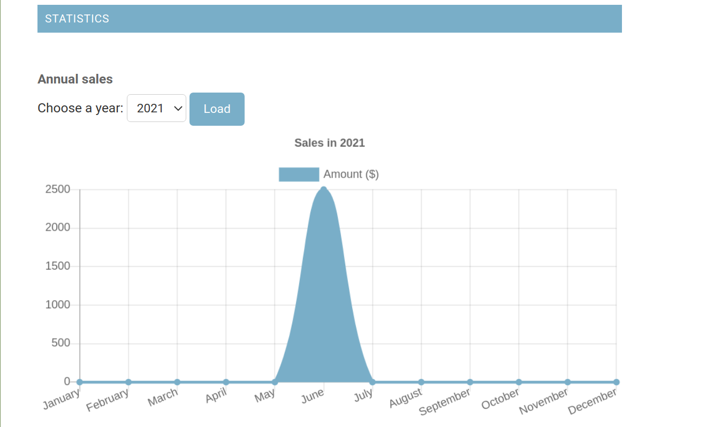
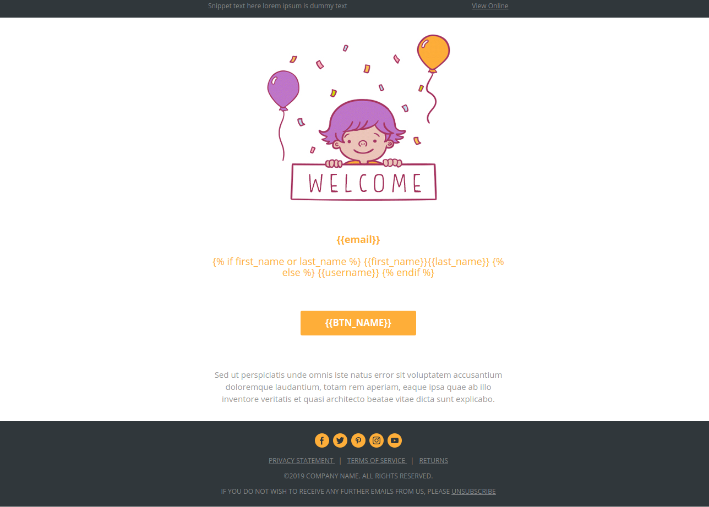
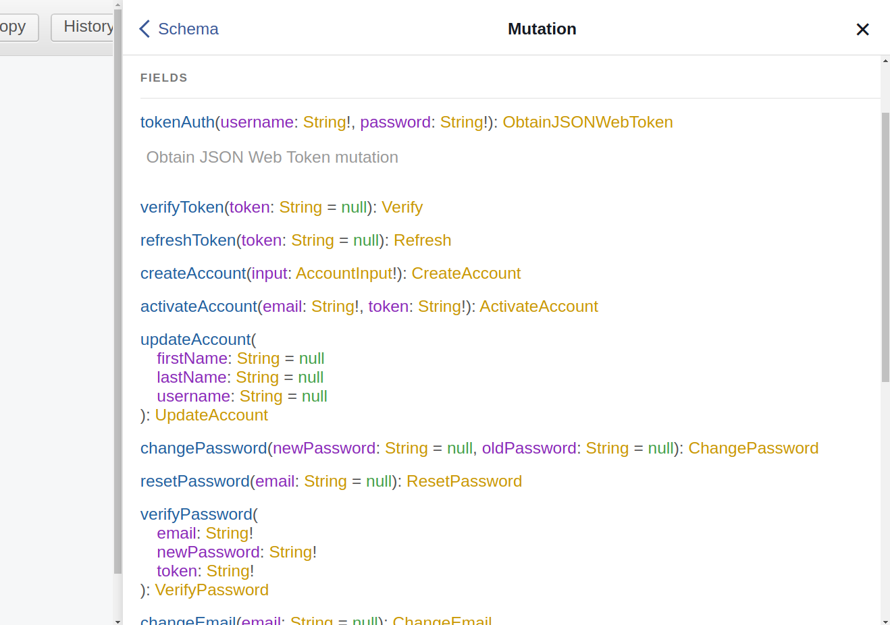

## About The Project
The project is a jewelry store, the price of gold is momentary and it is written with new [graphql](https://graphql.org/) architecture

#### Built With:
  - python
  - django
  - django graphql
  - web scraping 
  - rabbitmq 
  - redis
  - celery 
  - celery beat
  - docker 
  - nginx
  - postgres
  
   ------------------------------------
   
## Getting Started:

   ### Prerequisites
   - docker
      for download docker in [link](https://docs.docker.com/engine/install/)

   - docker-compose
      for download docker in [link](https://docs.docker.com/compose/install/)

   - STOP redis server in local
   - STOP rabbitmq server in local
  
   #### create volume

        docker volume create postgres_data
        
        docker volume create static_file
        
        docker volume create media_file
   
   #### create network
   
        docker network create main
        
        docker network create nginx_network
    
   #### run service 
 
        docker-compose up -d --build
    
   ##### cd **nginx/**  
        ***move nginx folder***

        docker-compose up -d --build
        docker-compose up -d --build

   ##### create superuser in django
        docker exec -it <dockercontainerid, backend container> python manage.py createsuperuser

## Screenshot:
   ##### 1.Statistics

   ##### 

##### 2.Email Template

   ##### 

##### 3.Complete document for Front-End

   ##### 
   